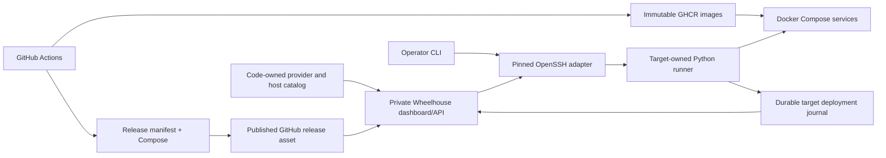

# Wheelhouse architecture

*Last updated: 2026-09-19*

## Runtime

A .NET 10 host serves the private administration API and React dashboard.
PostgreSQL stores the product registry and legacy inventory tables; bespoke SQL migrations run on startup.
GitHub cookie authentication and an owner allowlist protect administration.
Production requires a nonempty owner allowlist.

## Responsibilities

| Layer | Responsibility |
|---|---|
| Domain | Product, server, deployment, domain and secret models |
| Application | Product use cases and deployment gateway requests |
| Infrastructure | SDK integration clients and bounded runner-process adapter |
| Persistence | PostgreSQL EF mapping, repositories and bespoke migration files |
| API | Host wiring, authorization, request validation, controllers and SPA serving |
| Python runner | Code-owned fleet, release discovery, bundle validation, SSH, rollout and recovery |

The pre-existing server/deployment/domain/secret database models are retained for compatibility.
The current server API reads the code-owned fleet; it cannot create or delete hosts.
The essential deployment execution journal lives on each target, with a durable local submission index.
It is not yet projected into the old deployment table. This avoids pretending the placeholder's web/API image tags
represent a verified multi-service release.

## Deployment contract

A reviewed bundle contains immutable service image references, one source commit, CPU platform,
a hashed Compose definition, required configuration names and an explicit rollback-compatibility decision.
A code-owned target binding supplies server identity, a provider enum, an environment enum, runtime setting file paths and smoke probes.
The API accepts target/release IDs only. It cannot upload arbitrary Compose, run shell commands or disclose SSH keys.

The dashboard lists published release assets from repositories declared in `artifacts.py`.
Drafts, incomplete assets, branches and CI run states are excluded. Selection downloads and validates the archive,
its GitHub checksum, source tag/commit and exact approved service registries before target mutation.
The runner pulls the recorded digests before changing running containers. A release listing does not promise
that an image subsequently deleted from the registry is still pullable.

`fleet.py` declares providers, hosts and environment bindings in code. Mounted files hold credentials only.
No JSON file, database row or HTTP call can register a new host or provider.
The old single-image version query remains a legacy diagnostic endpoint; the dashboard no longer calls it.
Wheelhouse has no build, Git push, tag creation or CI-dispatch operation.

A target lock serializes dashboard and operator changes. Pulls precede mutation.
The target saves intent before applying Compose, verifies exact image references and health, and records the result.
An SSH disconnect or control-plane restart does not kill the detached target worker.
Interrupted or unrecovered mutation requires explicit reconciliation.

Image recovery requires a declared schema-compatibility guarantee. It does not restore the database.
Compose replacement has a restart window; this implementation does not promise zero downtime.

## Infrastructure governance

Products and the code-owned fleet are the implemented inventory. Deployment is the essential operational slice.
Domain registration/DNS automation, a secrets vault, provisioning, capacity/cost inventory and continuous fleet monitoring
remain separate capabilities in the [governance plan](../planning/deployment-pilot.md).
The first product is ForeverPin: management API/SPA plus redirect API sharing a product database.

A different VPS requires a reviewed fleet code change and a new Wheelhouse build; product images remain unchanged.
State relocation requires an explicit database/volume transfer and cutover plan.

## Security and recovery

Wheelhouse stays private through a tunnel/private network. OpenSSH requires a pinned known-hosts file.
Runtime secrets live in protected host files, mounted read-only into applications.
Persistent cookie key volumes survive container replacement.
The dashboard receives safe failure categories; raw runtime logs remain on the target.

Release bundles are privileged operator inputs. Hash checks bind files together, not publishers to identities.
Artifact repositories and expected image names are code-owned. Optional read-only GitHub authentication
is sent only to the API origin and is stripped from cross-origin redirects.
See the [CI and artifact policy](../planning/ci-artifact-policy.md) for publication and retention.
A database backup and the cookie/recovery keys must be recoverable without Wheelhouse.

Executable commands, directory layouts and VPS wiring gates are in [deployment operations](../deployment/deployment.md).
