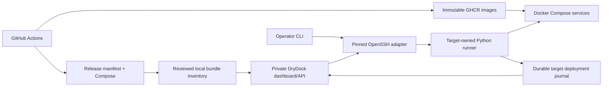

# DryDock architecture

*Last updated: 2026-09-19*

## Runtime

A .NET 10 host serves the private administration API and React dashboard.
PostgreSQL stores the product/server registries; bespoke SQL migrations run on startup.
GitHub cookie authentication and an owner allowlist protect administration.
Production requires a nonempty owner allowlist.

## Responsibilities

| Layer | Responsibility |
|---|---|
| Domain | Product, server, deployment, domain and secret models |
| Application | Product/server use cases and deployment gateway requests |
| Infrastructure | SDK integration clients and bounded runner-process adapter |
| Persistence | PostgreSQL EF mapping, repositories and bespoke migration files |
| API | Host wiring, authorization, request validation, controllers and SPA serving |
| Python runner | Bundle validation, SSH transport, target lock, rollout and recovery |

The pre-existing deployment/domain/secret database entities remain scaffold models.
The essential deployment execution journal lives on each target, with a durable local submission index.
It is not yet projected into the old deployment table. This avoids pretending the placeholder's web/API image tags
represent a verified multi-service release.

## Deployment contract

A reviewed bundle contains immutable service image references, one source commit, CPU platform,
a hashed Compose definition, required configuration names and an explicit rollback-compatibility decision.
An operator-owned target binding supplies server identity, environment, runtime setting file paths and smoke probes.
The API accepts target/release IDs only. It cannot upload arbitrary Compose, run shell commands or disclose SSH keys.

The dashboard can list imported bundles, select an environment, submit a deployment and poll its outcome.
Existing single-image GitHub version discovery is informational; it does not create an accepted multi-service bundle.
Automatic release-asset import and a history browser remain subsequent UI work.

A target lock serializes dashboard and operator changes. Pulls precede mutation.
The target saves intent before applying Compose, verifies exact image references and health, and records the result.
An SSH disconnect or control-plane restart does not kill the detached target worker.
Interrupted or unrecovered mutation requires explicit reconciliation.

Image recovery requires a declared schema-compatibility guarantee. It does not restore the database.
Compose replacement has a restart window; this implementation does not promise zero downtime.

## Infrastructure governance

Products and servers are the implemented inventory. Deployment is the essential operational slice.
Domain registration/DNS automation, a secrets vault, provisioning, capacity/cost inventory and continuous fleet monitoring
remain separate capabilities in the [governance plan](../planning/deployment-pilot.md).
The first product is ForeverPin: management API/SPA plus redirect API sharing a product database.

A different VPS uses a new target binding without rebuilding the product.
State relocation requires an explicit database/volume transfer and cutover plan.

## Security and recovery

DryDock stays private through a tunnel/private network. OpenSSH requires a pinned known-hosts file.
Runtime secrets live in protected host files, mounted read-only into applications.
Persistent cookie key volumes survive container replacement.
The dashboard receives safe failure categories; raw runtime logs remain on the target.

Release bundles are privileged operator inputs. Hash checks bind files together, not publishers to identities.
Only reviewed CI artifacts may be imported.
A database backup and the cookie/recovery keys must be recoverable without DryDock.

Executable commands, directory layouts and VPS wiring gates are in [deployment operations](../deployment/deployment.md).
