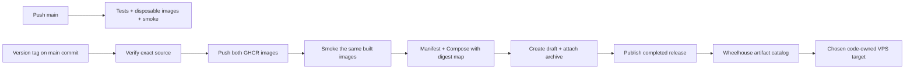

# Git, CI and deployment artifacts

*Last updated: 2026-09-19*

## Decision

Use `main` for development and explicit version tags for deployable releases.
A main push verifies the code and builds disposable images; it does not publish a deployment candidate.
A version tag on a commit already in `main` verifies, publishes and smoke-tests both service images,
then publishes one complete release bundle. Wheelhouse lists that bundle and deploys its recorded digests.

This is the recommended cadence, implemented locally for review. No workflow, tag, image or release was published by this task.
The user can instead choose a deployable candidate for every successful main push; that changes publishing frequency,
retention and promotion labels, but not the bundle or target execution contract.

## Current evidence

The live repository `sulton-max/10x-venture-forever-pin` is public and uses `main`.
Read-only GitHub queries on September 19 returned no workflows, releases or workflow runs.
The deployment changes and proposed workflows currently exist in the local working tree only.
A local build includes uncommitted files. GitHub Actions can only build files committed and pushed to its selected revision.
Before a release, include every required code, dependency, Dockerfile and workflow change in the published revision.
Unrelated product work can stay local; required uncommitted runtime fixes cannot be omitted from a release and still be claimed as tested.

## Main-only workflow

| Event | Verification and build | Persistent deployment artifact | Wheelhouse visibility |
|---|---|---|---|
| Local edit or local commit | Local verifier when requested | None | None |
| Push to `main` | Backend/frontend checks, both Linux images, real smoke, replacement/persistence check | None; runner-local images expire with the job | None |
| Push a version tag such as `v0.9.0-rc.1` | Repeat verification at the exact tagged source; publish and exercise both image outputs | GHCR images plus a complete GitHub release bundle | Published prerelease, explicitly labelled |
| Push a version tag such as `v0.9.0` | Same pipeline and gates | Stable release bundle | Published stable release |
| Failed or cancelled build | Failure remains in GitHub Actions | No published release bundle; an unused image may remain | None |
| Deploy to staging or production | Pull the selected digests and apply target configuration | Same release bytes | Deployment outcome |

Tags identify snapshots; they do not require release branches. `main` can advance after tagging an older known-good commit.
The workflow checks that the tag commit belongs to `main`; it does not silently build the newest head of `main`.
Never move or reuse a release tag. Use another patch or prerelease version for changed source.
The first private pilot can use a prerelease; that label is not evidence that unfinished product features are ready for public use.

A tag build must finish before the operator selects its artifact. Wheelhouse has no pending-build row or Build button.
Normal commits remain cheap; a deployable release is an intentional cut. If frequent staging deployments become the norm,
an explicit candidate-per-main policy can be added, using commit/run IDs and short retention for candidates.
It is not required to deploy ForeverPin today.

## Publication sequence and failure boundaries

1. Reject an already existing release for the exact version. Authentication/network errors do not count as a missing release.
2. Check the version syntax and source ancestry; run frontend and backend verification.
3. Build both services for `linux/amd64`. Load the built images for smoke and push their release tags to GHCR.
4. Check guest creation, saved-code ownership, SVG rendering, redirect and persistence after replacement.
5. Record both image digests, source SHA, architecture, Compose checksum and runtime setting requirements.
6. Create a draft release, upload `foreverpin-release.tar.gz`, then publish it.
7. Wheelhouse discovers published releases with a complete uploaded asset and SHA-256 metadata.
8. Selection verifies the archive hash, its internal contract, approved image names and the tag's source commit.
9. The target pulls all recorded image digests before replacing containers and verifies readiness afterwards.

An image push can succeed before smoke or the second image fails. That image is not a release and is never listed by Wheelhouse.
A failed draft stays hidden; it is diagnosed explicitly rather than overwritten by a rerun.
The workflow cannot atomically publish registry objects and a GitHub release, so the final release bundle is the visibility boundary.

The previous `release: published` trigger attached the archive after publication. That exposes an incomplete release window
and conflicts with immutable releases, which prohibit adding assets after publication.
The tag-triggered draft-first sequence supports enabling GitHub release immutability later.
No repository setting was changed here. Local discovery also rechecks asset hashes and tag/source identity when selecting a release.

External actions are pinned to resolved commit SHAs. Normal main CI receives read-only repository permission;
only the version workflow grants package writes and release publication writes to the jobs that need them.
Wheelhouse's credentials are read-only and cannot trigger CI or publish packages.

## Registry choice, size and retention

Use GitHub Container Registry (`ghcr.io`) for this portfolio. Docker is the image format/runtime; Docker Hub is a separate registry.
Keep one image repository per service, with a release tag as a human label and the digest as deployment identity.
Both services' exact digests live in the same bundle; a mutable `latest` tag is not part of the deployment contract.
Adding a version tag does not create another product repository.

GitHub currently documents Container Registry image storage and bandwidth as free, with advance notice before policy changes.
This is current pricing policy, not an unlimited-storage guarantee. Actions artifact/log storage and Actions compute are separate services.
For public repositories, standard hosted Actions runners are free; larger runners have separate billing.
No paid runner or plan change is part of this workflow.

The initial local ARM images were approximately 1.1 GB each uncompressed because RID-neutral .NET output included other platforms'
native assets and Windows debug symbols. Publishing with an explicit Linux runtime identifier removes unused runtime families.
The resulting local ARM images measure 443,557,503 bytes (management) and 435,977,901 bytes (redirect),
about 60% smaller. Saved ownership, native SVG generation and redirects passed after replacement.
Registry bytes are compressed and layers can be shared, so local image sizes cannot be multiplied directly to predict billed registry storage.
CI builds the selected platform only; `linux/amd64` still requires its first hosted verification.

Retention policy:

- Keep every currently deployed digest and every declared rollback/recovery dependency, across all hosts and environments.
- Keep at least the most recent 10 released bundles and their images; extend this for the chosen recovery window.
- Treat failed-run/orphan image cleanup separately; never delete an image merely because its tag is old or absent.
- Do not automate deletion until Wheelhouse has a cross-host reference inventory and protected-set checks.
- Keep local VPS image caches bounded with an operator-reviewed policy; no blanket image/volume prune during deployment.

GitHub Actions artifacts normally expire after 90 days. They are useful for temporary logs/test outputs,
but they are not the authoritative deployment catalog. The small bundle is a GitHub release asset;
container layers remain in GHCR. This avoids retaining full Docker image tarballs in Actions storage.

First-publish gate: GHCR packages can initially be private even when the source repository is public.
Verify each package's visibility explicitly. Public images can be pulled anonymously; private images require a target-side read-only credential.
The pipeline does not change package visibility automatically. Public images must never contain secrets or local configuration files.

Docker Hub can hold public repositories but applies pull/fair-use limits; it provides no advantage over the existing GitHub/GHCR setup here.
Normal image retention at this portfolio's release cadence is manageable. There is no operational reason to store an image for every edit.

## Wheelhouse artifact catalog

`artifacts.py` declares approved repositories, artifact providers, archive names and service-to-image repository mappings in code.
The first source is ForeverPin. It reads published GitHub release assets, not branch heads, commit lists, Actions runs or arbitrary registry tags.
The dashboard offers Refresh artifacts and Deploy release; neither action builds or changes Git.
Drafts, missing/checksum-less assets and incomplete uploads are excluded. Prereleases are labelled.

Discovery is bounded to the 100 most recent releases per source. A removed asset no longer appears, and submission rechecks availability.
Already deployed bundles remain in the target recovery journal. Older releases can be recovered explicitly from that journal;
expanding normal browsing beyond the recent catalog is separate work.
The catalog trusts the approved repository publisher. It validates release contents and source identity;
signed CI provenance/attestation verification is a later gate, not an implemented guarantee.
The archive and source metadata are cached after selection. Registry deletion can still make a listed release unpullable;
this is rejected before container replacement, not treated as a healthy deployment.

Unauthenticated GitHub discovery hit the shared IP's rate limit during local verification.
A mounted read-only GitHub token is supported through `Deployment:GitHubTokenFile` (API) or `WHEELHOUSE_GITHUB_TOKEN_FILE` (CLI).
Live authenticated discovery returned an empty catalog, matching GitHub's current release list.
Tokens are sent only to the GitHub API and stripped from cross-origin redirects; tokens never enter bundles, arguments or logs.
Public source discovery is implemented; private release-asset download is not an implemented provider capability yet.

## Code-owned VPS integration

`fleet.py` is the authority for provider enums, host identities and product/environment bindings.
The first supported `VpsProvider` is `Hetzner`; environments are `Staging` and `Production` (serialized lowercase).
The deployed catalog is empty until verified VPS details are supplied. No placeholder host is silently enabled.

Adding a VPS means adding a reviewed `Server` and its `Target` bindings in source, testing and rebuilding Wheelhouse.
Adding a provider also requires an enum member, its explicit integration behavior and contract tests.
There are no dynamic plugins, provider URLs, Add VPS form or server mutation API.
Existing database server rows are retained but no longer control execution.
The UI can filter the configured hosts by provider and choose a configured deployment target.

SSH key and known-host files are mounted separately; runtime settings remain protected files on the target.
Product images do not change when choosing another VPS. Data and persistent keys must be moved and verified separately.
Use stable unique IDs; do not reuse an old host/target ID for another machine. Submission records snapshot the SSH identity references,
so later catalog edits do not redirect polling of an already launched job to a different host.
Wheelhouse itself requires a rebuild for a catalog code change; the operator recovery runner remains independent of its UI process.

## Remaining publication and launch work

- Review the chosen tag cadence and commit the intended ForeverPin release source.
- Push the workflow/source changes; observe a main verification run.
- Publish an agreed version tag; observe the first hosted `linux/amd64` build, smoke and complete release asset.
- Verify GHCR visibility and immutable-release settings without assuming repository visibility applies to images.
- Configure a read-only catalog token and the code-owned VPS bindings.
- Deploy the listed bundle to staging; complete the [pilot's live gates](deployment-pilot.md#shipping-sequence-and-acceptance).

## Primary sources

- [Container Registry pricing](https://docs.github.com/en/billing/concepts/product-billing/github-packages)
- [Container Registry permissions, visibility and digest pulls](https://docs.github.com/en/packages/working-with-a-github-packages-registry/working-with-the-container-registry)
- [GitHub Actions billing](https://docs.github.com/en/billing/concepts/product-billing/github-actions)
- [Actions artifact retention](https://docs.github.com/en/organizations/managing-organization-settings/configuring-the-retention-period-for-github-actions-artifacts-and-logs-in-your-organization)
- [Draft-first immutable releases](https://docs.github.com/en/repositories/releasing-projects-on-github/managing-releases-in-a-repository)
- [Immutable release guarantees](https://docs.github.com/en/code-security/concepts/supply-chain-security/immutable-releases)
- [Release API and published asset discovery](https://docs.github.com/en/rest/releases/releases)
- [Docker Hub usage and pull limits](https://docs.docker.com/docker-hub/usage/)
