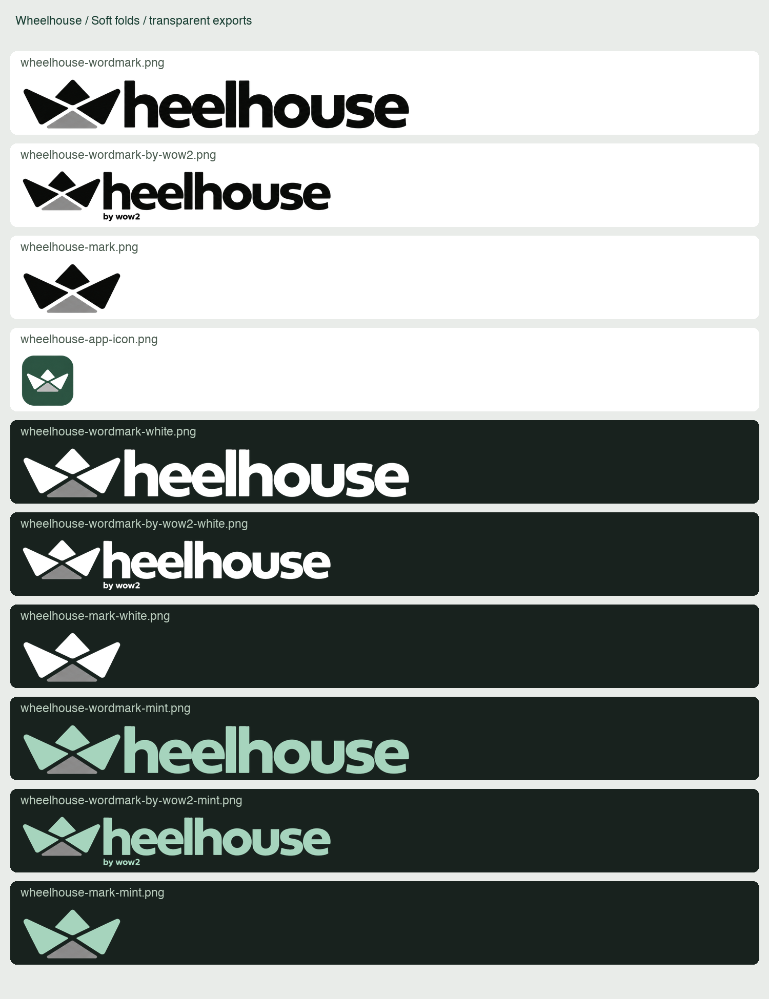

# Wheelhouse brand assets

*Last updated: 2026-09-29*

> Selected **Soft folds** identity: a rounded paper boat replacing the initial W.

## Usage

- default: compact wordmark without a flag or attribution
- optional endorsement: `by wow2`, beneath the lettering
- standalone mark: compact navigation, app lists and icon contexts
- black: light surfaces; white or mint: dark surfaces
- lower triangle: gray in every variant
- fold gaps and letter counters: transparent negative space
- app icon: opaque green tile; transparency outside its rounded corners
- PNG files retain native raster resolution; larger or vector exports are not included

---

## Exports

All ten files are cropped RGBA PNGs, with eight pixels of transparent safety padding.
The app icon uses a square canvas and centers the original tile without stretching it.

| Asset | Size | Files |
|---|---|---|
| Default wordmark | 1173 × 163 | [Black](soft-folds/wheelhouse-wordmark.png) · [White](soft-folds/wheelhouse-wordmark-white.png) · [Mint](soft-folds/wheelhouse-wordmark-mint.png) |
| Wordmark with attribution | 1173 × 204 | [Black](soft-folds/wheelhouse-wordmark-by-wow2.png) · [White](soft-folds/wheelhouse-wordmark-by-wow2-white.png) · [Mint](soft-folds/wheelhouse-wordmark-by-wow2-mint.png) |
| Standalone boat | 308 × 163 | [Black](soft-folds/wheelhouse-mark.png) · [White](soft-folds/wheelhouse-mark-white.png) · [Mint](soft-folds/wheelhouse-mark-mint.png) |
| App icon | 312 × 312 | [Green tile](soft-folds/wheelhouse-app-icon.png) |

---

## Source and processing

- [Selected artwork](source/soft-folds-selection.png): the approved comparison board's upper row, cropped without resampling
- [Attribution lettering](source/by-wow2-attribution.png): `by wow2` cropped from the approved optional-attribution composition
- exports use direct pixel processing of these sources; no generated redraws are included
- opaque source pixels retain their original colors in the black and green exports
- antialiased boundary pixels are unmatted against the original white page
- standalone boats use the same pixels as the default wordmark
- attribution reuses the existing lettering at native size, aligned beneath the first h
- white and mint variants share the black export's exact alpha channel
- white foreground: `#ffffff`; mint foreground: `#a6d4bd`; gray lower facet retained
- all exported PNGs were checked for transparent margins and intact opaque interiors
- `preview.png` is a presentation sheet, not a transparent logo asset

These files are the saved brand assets. Application integration is separate.
